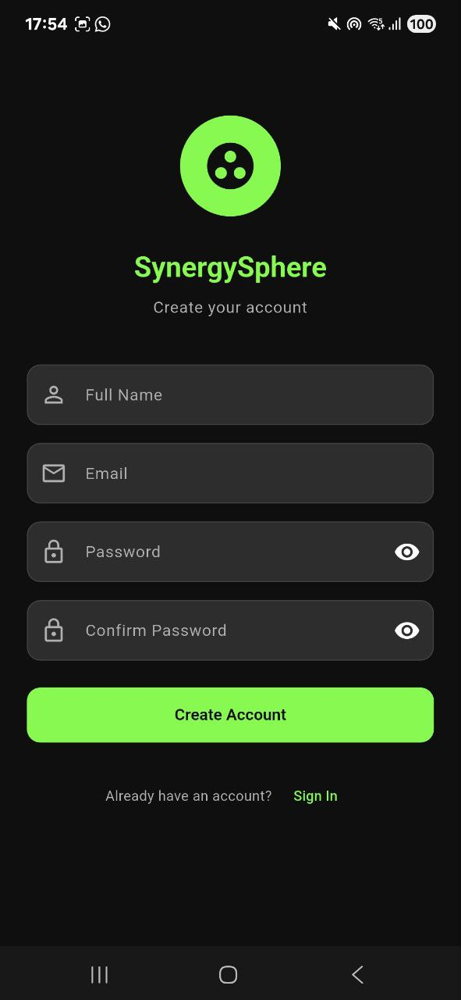
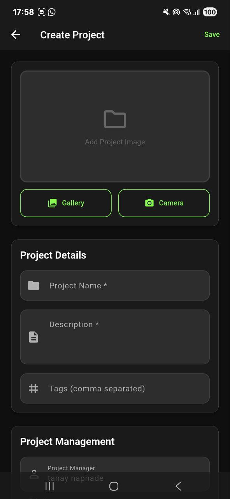
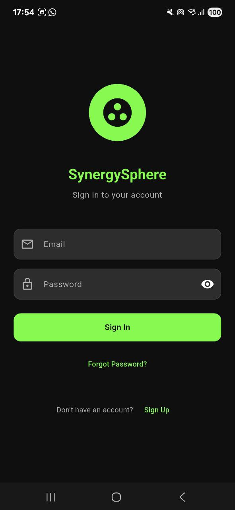
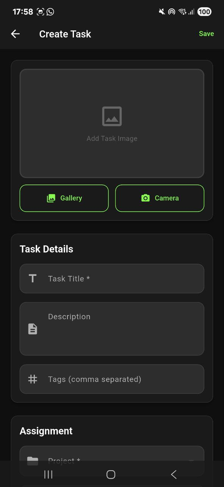
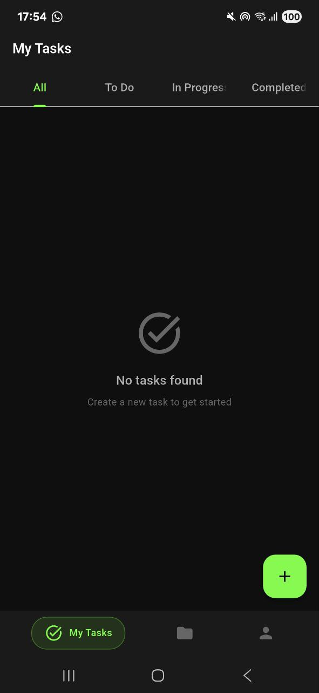
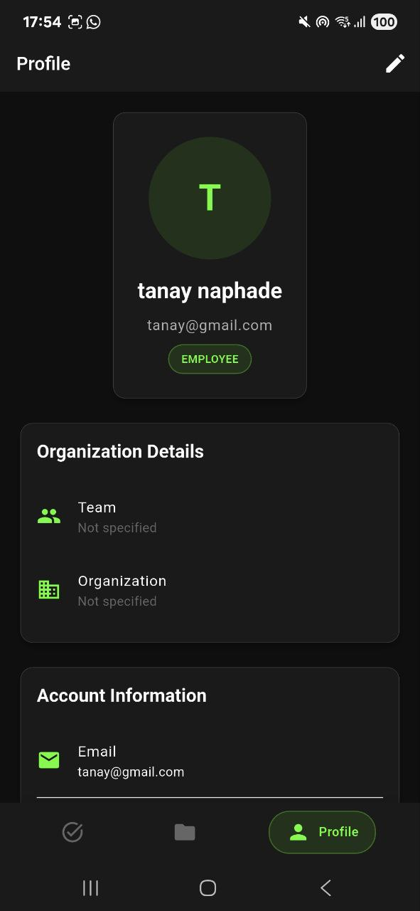
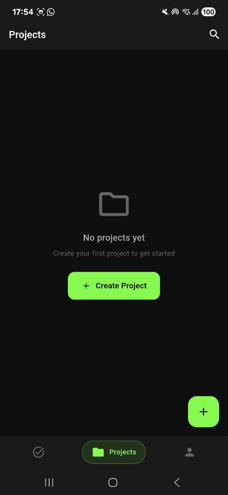

# SynergySphere - Advanced Team Collaboration Platform

## Overview

SynergySphere is a comprehensive mobile task management and team collaboration platform designed to streamline project workflows, enhance team communication, and boost productivity. Built with modern mobile-first architecture, SynergySphere provides an intuitive interface for managing tasks, tracking progress, and facilitating seamless team collaboration.

## Features

### 🔐 User Authentication
- Secure user registration and login
- Role-based access control (Employee, Manager, Admin)
- Password reset functionality
- Account management and profile settings

### 📋 Task Management
- Create, assign, and track tasks with due dates
- Task status management (To Do, In Progress, Completed)
- Priority levels and task categorization
- Progress tracking and reporting
- Task comments and collaboration

### 👥 Team Collaboration
- Project-based team organization
- User profile management with organizational hierarchy
- Team member assignment and management
- Real-time updates and notifications

### 📱 Mobile-First Design
- Responsive UI optimized for mobile devices
- Dark theme interface for comfortable viewing
- Intuitive navigation with bottom tab structure
- Clean, modern Material Design principles

## Screenshots

The application features a sleek dark theme interface with the following key screens:

- **Sign Up/Sign In**: Secure authentication with form validation
- **Task Dashboard**: Comprehensive view of all tasks with filtering options
- **Profile Management**: User details and organizational information
- **Project Overview**: Project-based task organization

## Images









## Technology Stack

- **Frontend**: React Native / Flutter (Mobile Framework)
- **Backend**: Node.js with Express.js / Spring Boot
- **Database**: MongoDB / PostgreSQL
- **Authentication**: JWT (JSON Web Tokens)
- **State Management**: Redux / Provider Pattern
- **API**: RESTful services
- **Deployment**: Docker containerization ready

## Installation

### Prerequisites

Before setting up SynergySphere, ensure you have the following installed:

- Node.js (version 14.x or higher)
- npm or yarn package manager
- Flutter SDK
- Android Studio (for Android development)
- Xcode (for iOS development, macOS only)
- Git

### Backend Setup

1. Clone the repository:
   ```bash
   git clone https://github.com/your-username/synergysphere.git
   cd synergysphere
   ```

2. Install backend dependencies:
   ```bash
   cd backend
   npm install
   ```

3. Configure environment variables:
   ```bash
   cp .env.example .env
   # Edit .env file with your database and JWT configurations
   ```

4. Start the backend server:
   ```bash
   npm run dev
   ```

### Mobile App Setup

1. For React Native:
   - iOS: `npx react-native run-ios`
   - Android: `npx react-native run-android`

2. For Flutter:
   ```bash
   flutter pub get
   flutter run
   ```

### Database Setup

1. Install and configure your chosen database (MongoDB/PostgreSQL)
2. Create the database schema using provided migration files
3. Seed the database with initial data (optional)

## Configuration

### Environment Variables

Create a `.env` file in the backend directory with the following variables:

```env
# Database Configuration
DB_HOST=localhost
DB_PORT=5432
DB_NAME=synergysphere
DB_USER=your_username
DB_PASSWORD=your_password

# JWT Configuration
JWT_SECRET=your_secret_key
JWT_EXPIRATION=24h

# Server Configuration
PORT=3000
NODE_ENV=development

# Email Configuration (optional)
SMTP_HOST=smtp.gmail.com
SMTP_PORT=587
SMTP_USER=your_email@gmail.com
SMTP_PASS=your_password
```

### API Configuration

Update the API endpoint in your mobile app configuration:

```javascript
// config/api.js
export const API_BASE_URL = 'http://localhost:3000/api/v1';
```

## Usage

### Getting Started

1. **Register an Account**: Create a new account using the sign-up screen
2. **Complete Profile**: Add your organizational details and role information
3. **Create Projects**: Set up projects and invite team members
4. **Manage Tasks**: Create, assign, and track tasks within your projects
5. **Collaborate**: Use built-in communication features to stay connected

### User Roles

- **Employee**: Can view assigned tasks, update task status, and communicate with team members
- **Manager**: Can create projects, assign tasks to employees, and monitor team progress
- **Admin**: Full system access including user management and organizational settings

### Task Workflow

1. Create a new task with title, description, and due date
2. Assign the task to a team member
3. Set priority level and category
4. Track progress through status updates
5. Collaborate using comments and file attachments

## API Documentation

### Authentication Endpoints

- `GET /api/users/login` - Get user profile
- `PUT /api/users/register` - Update user profile


### Project Create
- 
